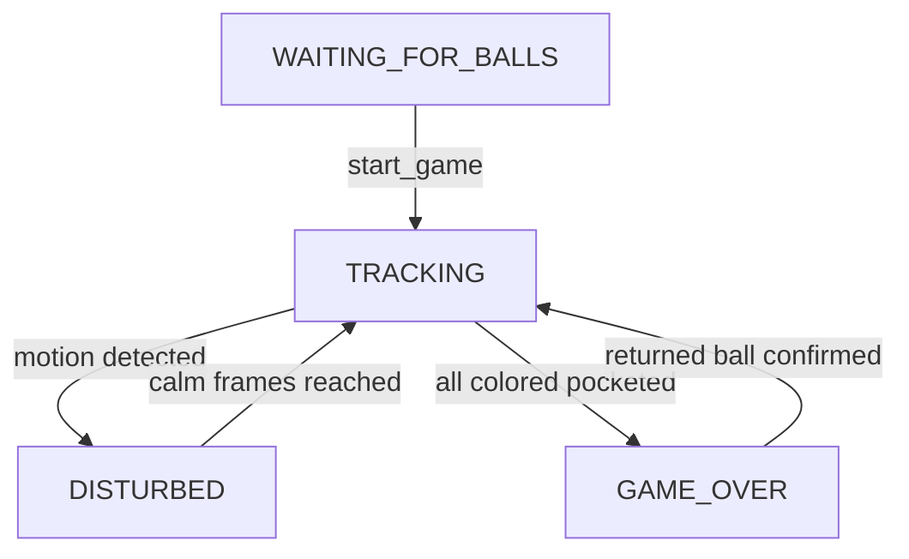

# SYSTEM_REPORT

## System Overview

This system is a real-time desktop pool assistant. It captures camera frames, detects ball positions/colors, tracks game state and strokes, computes suggested shot trajectories, and renders guidance overlays in a PyQt interface.

The runtime is organized into:

- Orchestration/UI: `main.py`, `app.py`
- Core domain logic: `core/`
- Detection/scene services: `services/`

## Runtime Architecture

- `main.py`
  - Entry point and tick orchestration.
  - Coordinates frame grab -> detection -> tracker update -> trajectory -> render.
- `app.py`
  - GUI flow (setup/calibration/main view), camera IO, overlay rendering, and status panel updates.
- `core/config.py`
  - Shared runtime constants for table/ball dimensions and geometry parameters.
- `core/game_tracker.py`
  - State machine (`WAITING_FOR_BALLS`, `TRACKING`, `DISTURBED`, `GAME_OVER`), stroke registration, pocket logic, and motion gating.
- `core/trajectory.py`
  - Shot planning (`suggest_best_shot`) and pocket-target scoring.
- `core/physics_engine.py`
  - Geometry helpers for path blocking and bank path generation.
- `services/ball_detection_test.py`
  - Hough-based ball detection and color classification service used by runtime.
- `services/scene_understanding.py`
  - Table-corner and homography helpers used by calibration and detection fallback.

## Behavioral Flow (Start to Finish)

1. `main.main()` initializes Qt, fonts, `GameTracker`, and `BilliardsApp`.
2. `BilliardsApp` calibration establishes camera homography (`cam_H`) and table corners.
3. On each tick, `main._run_tick()`:
   - grabs frame from `window.grab_frame()`
   - updates tracker with table corners (`gt.set_table_corners(...)`)
   - runs detection when `gt.needs_detection` via `services.ball_detection_test.detect_balls_with_color(...)`
   - adapts detections to internal ball dicts (`main._adapt_detections`)
   - advances state machine (`gt.update(frame, raw_balls)`)
   - computes shot suggestion with `core.trajectory.suggest_best_shot(...)` when tracking
   - renders final overlays/UI (`window.render(...)`)
4. `app._update_status_panel()` refreshes game state, stroke count, and rack/remaining presentation from latest runtime data.
5. `core/game_tracker.py` transitions state based on motion/reacquisition and registers strokes/pocket events.

## Code References

- Main runtime orchestration: `main.main()`, `main._run_tick()`, `main._detect_balls()`
- Detection service: `services.ball_detection_test.detect_balls_with_color()`, `services.ball_detection_test.detect_balls_hough()`
- Tracker state machine: `core.game_tracker.GameTracker.update()`, `core.game_tracker.GameTracker._tick_tracking()`, `core.game_tracker.GameTracker._tick_disturbed()`
- Stroke/pocket logic: `core.game_tracker.GameTracker._check_for_stroke()`, `core.game_tracker.GameTracker._register_stroke()`
- Trajectory planner: `core.trajectory.suggest_best_shot()`
- Physics checks: `core.physics_engine.is_path_blocked()`, `core.physics_engine.find_bank_target_paths()`
- UI render/status: `app.BilliardsApp.render()`, `app.BilliardsApp._update_status_panel()`
- Scene calibration helpers: `services.scene_understanding.get_table_corners()`, `services.scene_understanding.compute_homography_from_corners()`

## Visual Logic

```mermaid
flowchart TD
    mainEntry[main.main] --> appInit[BilliardsApp setup]
    appInit --> tickLoop[QTimer tick]
    tickLoop --> grabFrame[window.grab_frame]
    grabFrame --> detectGate{gt.needs_detection}
    detectGate -->|true| detectBalls[services.detect_balls_with_color]
    detectGate -->|false| emptyDetections[raw_balls = []]
    detectBalls --> adaptDetections[main._adapt_detections]
    emptyDetections --> trackerUpdate
    adaptDetections --> trackerUpdate[gt.update]
    trackerUpdate --> shotGate{tracking state and >=2 balls}
    shotGate -->|true| suggestShot[core.suggest_best_shot]
    shotGate -->|false| renderFrame
    suggestShot --> renderFrame[window.render]
    renderFrame --> statusPanel[app._update_status_panel]
```



## Integrity Verification Summary

- Import path scan completed after module moves to `core/` and `services/`.
- Full module compile check passed for all runtime files (`py_compile`).
- Runtime import smoke test passed for `main`, `app`, `core.*`, and `services.*`.
- Execution flow trace from `main.main()` to render/status confirmed interface compatibility (ball dict contract, state values, and tracker-to-UI data flow).
